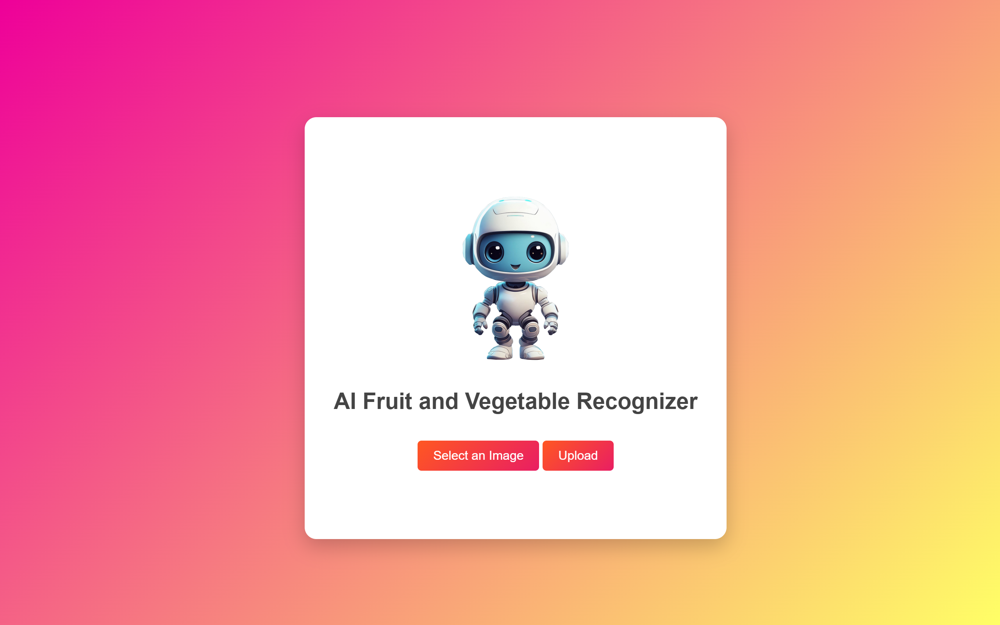
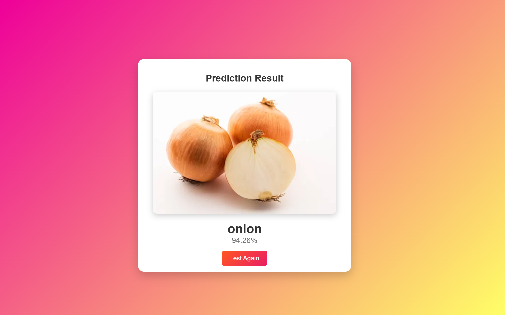

# **VegFruitAI**

An AI-powered fruit and vegetable recognition tool that uses a machine learning model to identify fruits and vegetables from uploaded images. The project includes a FastAPI backend and a user-friendly frontend.

---

### **Features**

- Recognize fruits and vegetables from image uploads.
- Seamlessly integrate AI with a visually appealing web interface.
- Easy-to-follow setup steps for running the project locally.

---

### **Getting Started**

Follow these steps to set up and run the project:

---

### **1. Download the Sample Data**

Download the sample data folder from [this link](https://drive.google.com/file/d/1CGiAWso43GCsNo_faRq4jdDIlmwy7YI4/view).  
Save the downloaded folder named **`Fruits_vegetables`** in the project root directory.

---

### **2. Set Up a Virtual Environment**

1. Create a virtual environment:
   ```bash
   python -m venv .venv
   ```
2. Activate the virtual environment:
   - On Windows:
     ```bash
     .venv\Scripts\activate
     ```
   - On macOS/Linux:
     ```bash
     source .venv/bin/activate
     ```
3. Install the dependencies:
   ```bash
   pip install -r requirements.txt
   ```

---

### **3. Generate the AI Model**

Run the `ai_code.py` script to train and generate the AI model:

```bash
python ai_code.py
```

This will automatically save the trained model in the project root directory.

---

### **4. Start the FastAPI Server**

Run the FastAPI server using **Uvicorn**:

```bash
uvicorn main:app --reload
```

The server will be accessible at:  
[http://localhost:8000](http://localhost:8000)

---

### **5. Upload an Image**

1. Open the frontend in your web browser.
2. Upload any image of a fruit or vegetable.
3. The AI will predict and display the name of the fruit/vegetable.
4. It is recommended that you upload jpeg or jpg files.

---

### **Screenshots**




---

### **Project Structure**

```plaintext
VegFruitAI/
├── Fruits_vegetables/      # Folder with sample data (downloaded separately)
├── .venv/                  # Virtual environment
├── ai_code.py              # Script to generate the AI model
├── main.py                 # FastAPI server code
├── requirements.txt        # List of dependencies
├── screenshots/            # Webpage screenshots
├── README.md               # Project documentation
└── static                          #frontend
```

---

Feel free to reach out if you have any questions or issues! 😊
